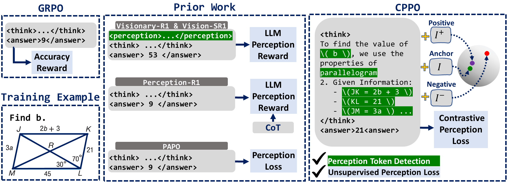
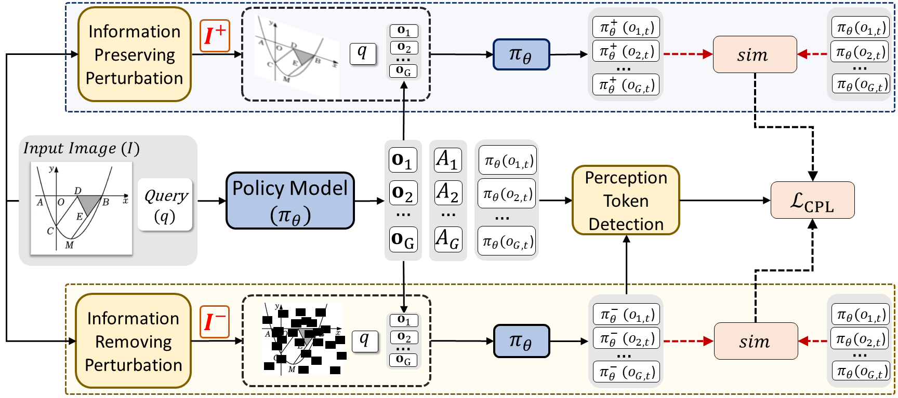
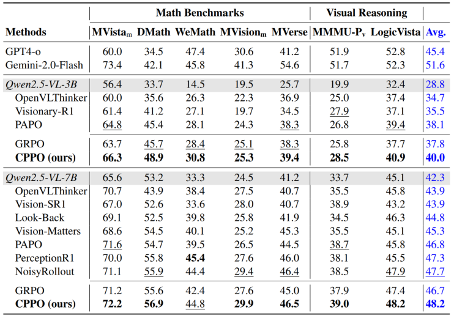

<div align="center">

# **CPPO: Contrastive Perception for Vision Language Policy Optimization**

</div>

<div align="center">

</div>

This repository contains the description and implementation of CPPO, a reinforcement learning framework for finetuning vision–language models (VLMs).

## Methodology

### 1. Entropy-Based Perception Token Detection

For each generated response, CPPO identifies perception tokens by measuring the increase in predictive entropy when the input image is replaced with an information-removing perturbation. Tokens with the largest entropy increase are selected as perception-dependent tokens. This process:

- Requires no external supervision

- Is fully model-driven

- Preserves the natural reasoning structure of the VLM

### 2. Contrastive Perception Loss (CPL)

For each detected perception token, CPPO applies a token-level contrastive loss:

- Anchor: token distribution conditioned on the original image
- Positive: distribution conditioned on an information-preserving perturbation
- Negative: distribution conditioned on an information-removing perturbation

### 3. Integration with Reinforcement Learning

CPPO augments the standard RL objective with the Contrastive Perception Loss:

- CPL is applied only to perception tokens
- CPL is gated by positive advantage, ensuring it reinforces successful trajectories

This design yields targeted perception improvement while maintaining RL stability.

<div align="center">

</div>

### Main Results
CPPO is evaluated on a wide range of multimodal reasoning benchmarks and consistently improves the baseline RL objective.

<div align="center">

</div>

## Code Availability

🚧 Code will be released soon.


## Citation

If you find this work useful, please consider giving us a star and citing our work.
```
@article{rezaei2026cppo,
    title={CPPO: Contrastive Perception for Vision Language Policy Optimization},
    author={Rezaei, Ahmad and Gholami, Mohsen and Ranjbar Alvar, Saeed and Cannons, Kevin and Hossain, Mohammad Asiful and Weimin, Zhou and Zhou, Shunbo and Zhang, Yong and Akbari, Mohammad},
    journal={arXiv preprint arXiv:XXXX.XXXXX},
    year={2026}
}
```

